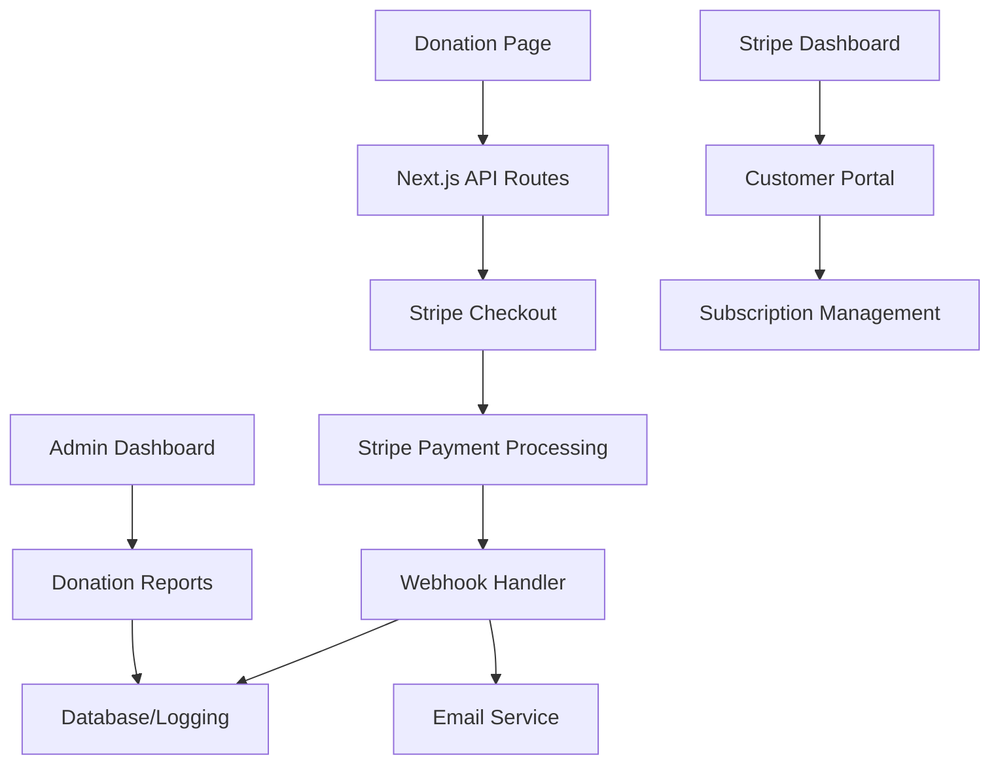

# Design Document

## Overview

The Stripe donation integration will transform the existing donation page into a fully functional payment system. The design leverages Stripe Checkout for secure payment processing, Next.js API routes for server-side operations, and Stripe webhooks for reliable event handling. The solution maintains the existing UI/UX while adding robust payment capabilities for both one-time and recurring donations.

## Architecture

### High-Level Architecture



### Component Architecture

- **Frontend Components**: Enhanced donation form with Stripe integration
- **API Layer**: Next.js API routes for Stripe operations
- **Payment Processing**: Stripe Checkout and Subscriptions API
- **Event Handling**: Webhook endpoints for payment events
- **Data Layer**: Transaction logging and reporting
- **Email System**: Automated confirmation and receipt emails

## Components and Interfaces

### Frontend Components

#### Enhanced Donation Form (`src/app/donate/page.tsx`)
- Maintains existing UI and animations
- Adds form validation for Stripe requirements
- Integrates loading states and error handling
- Handles redirect to Stripe Checkout

```typescript
interface DonationFormData {
  amount: number;
  category: 'Tithes' | 'Offerings' | 'Building Fund' | 'Missions';
  type: 'oneoff' | 'recurring';
  frequency?: 'weekly' | 'monthly' | 'yearly';
  email?: string;
}
```

#### Success/Cancel Pages
- `src/app/donate/success/page.tsx`: Post-payment confirmation
- `src/app/donate/cancel/page.tsx`: Payment cancellation handling

### API Routes

#### Checkout Session Creation (`src/app/api/stripe/checkout/route.ts`)
```typescript
interface CheckoutRequest {
  amount: number;
  category: string;
  type: 'payment' | 'subscription';
  frequency?: string;
  email?: string;
}

interface CheckoutResponse {
  sessionId: string;
  url: string;
}
```

#### Webhook Handler (`src/app/api/stripe/webhook/route.ts`)
```typescript
interface WebhookEvent {
  type: string;
  data: {
    object: any;
  };
}
```

#### Customer Portal (`src/app/api/stripe/portal/route.ts`)
```typescript
interface PortalRequest {
  customerId: string;
}

interface PortalResponse {
  url: string;
}
```

### Stripe Configuration

#### Environment Variables
```
STRIPE_PUBLISHABLE_KEY=pk_test_...
STRIPE_SECRET_KEY=sk_test_...
STRIPE_WEBHOOK_SECRET=whsec_...
NEXT_PUBLIC_STRIPE_PUBLISHABLE_KEY=pk_test_...
```

#### Stripe Products and Prices
- Dynamic price creation for one-time donations
- Recurring price objects for subscription frequencies
- Metadata tracking for donation categories

## Data Models

### Donation Transaction
```typescript
interface DonationTransaction {
  id: string;
  stripeSessionId: string;
  stripePaymentIntentId?: string;
  stripeSubscriptionId?: string;
  amount: number;
  currency: string;
  category: string;
  type: 'oneoff' | 'recurring';
  frequency?: string;
  status: 'pending' | 'completed' | 'failed' | 'cancelled';
  customerEmail?: string;
  createdAt: Date;
  updatedAt: Date;
  metadata?: Record<string, any>;
}
```

### Subscription Record
```typescript
interface SubscriptionRecord {
  id: string;
  stripeSubscriptionId: string;
  stripeCustomerId: string;
  amount: number;
  currency: string;
  category: string;
  frequency: string;
  status: 'active' | 'cancelled' | 'past_due' | 'unpaid';
  customerEmail: string;
  createdAt: Date;
  updatedAt: Date;
  nextPaymentDate?: Date;
}
```

## Error Handling

### Client-Side Error Handling
- Form validation errors displayed inline
- Network errors with retry mechanisms
- Stripe-specific error messages translated to user-friendly text
- Loading states during payment processing

### Server-Side Error Handling
- API route error responses with appropriate HTTP status codes
- Webhook event processing with retry logic
- Stripe API error handling and logging
- Database operation error recovery

### Error Types
```typescript
enum DonationErrorType {
  VALIDATION_ERROR = 'validation_error',
  PAYMENT_ERROR = 'payment_error',
  NETWORK_ERROR = 'network_error',
  SERVER_ERROR = 'server_error',
  STRIPE_ERROR = 'stripe_error'
}

interface DonationError {
  type: DonationErrorType;
  message: string;
  details?: any;
}
```

## Testing Strategy

### Unit Testing
- Form validation logic
- API route handlers
- Webhook event processing
- Utility functions for Stripe operations

### Integration Testing
- End-to-end donation flow
- Webhook event handling
- Email delivery confirmation
- Subscription lifecycle management

### Test Environment Setup
- Stripe test mode configuration
- Mock webhook events
- Test payment methods
- Automated test data cleanup

### Testing Scenarios
1. **Successful One-Time Donation**
   - Valid form submission
   - Stripe Checkout completion
   - Webhook processing
   - Email confirmation

2. **Successful Recurring Donation**
   - Subscription creation
   - First payment processing
   - Customer portal access
   - Subscription management

3. **Error Scenarios**
   - Invalid payment methods
   - Network failures
   - Webhook delivery failures
   - Email delivery issues

4. **Edge Cases**
   - Minimum donation amounts
   - Maximum donation limits
   - Duplicate submissions
   - Browser back button behavior

### Performance Testing
- Form submission response times
- API route performance under load
- Webhook processing efficiency
- Database query optimization

## Security Considerations

### API Security
- Stripe webhook signature verification
- Environment variable protection
- CORS configuration for API routes
- Rate limiting on donation endpoints

### Data Protection
- PII handling in compliance with regulations
- Secure storage of transaction metadata
- Audit logging for sensitive operations
- Regular security dependency updates

### Payment Security
- Stripe PCI compliance handling
- No storage of payment card data
- Secure redirect URLs
- HTTPS enforcement for all payment flows

## Deployment Considerations

### Environment Configuration
- Separate Stripe keys for development/production
- Webhook endpoint configuration
- Database connection strings
- Email service credentials

### Monitoring and Logging
- Transaction success/failure rates
- Webhook delivery monitoring
- Error rate tracking
- Performance metrics collection

### Backup and Recovery
- Transaction data backup procedures
- Webhook event replay capabilities
- Configuration backup strategies
- Disaster recovery planning